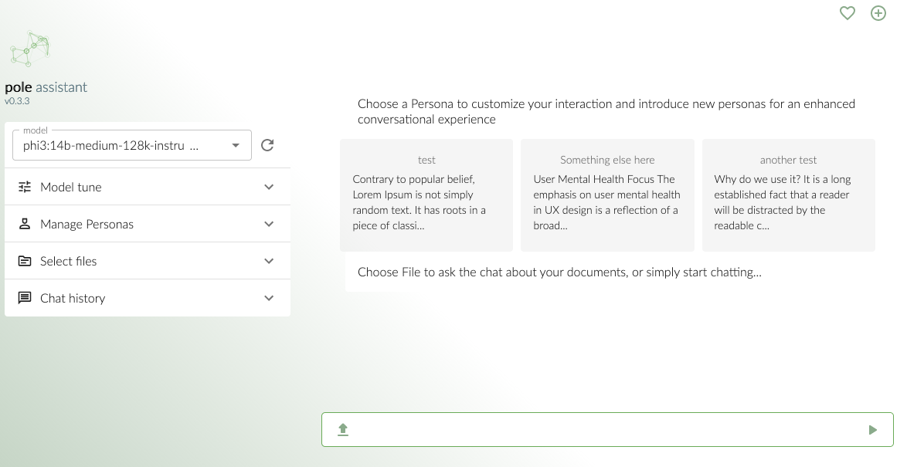
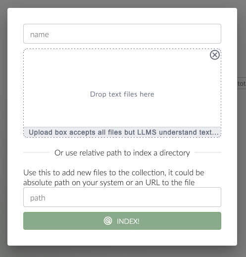

# Pole assistant

Is a tool meant for interactions with your offline LLM assitants.
The name stands for "field" in Polish but using the English meaning works for me as well!



# This is early beta, made with EDD model.

This early stage beta version is built upon the EDD model - short for Excitement Driven Development, a method that keeps the thrill alive while coding. It's exciting, but also means we need to be extra vigilant for any hiccups or missing bits.
While I did my best to make sure that all success paths work properly I cannot promise something won't break. Also some interactions are incomplite (there are no toast messages yet!). Every day I either add new feature or improve existing one

# Overview 





## Running 

### Docker

For now the easiest way to try it out is to use docker compose. Images are on dockerhub.

```
services:
  pole-api:
    image: kweg/pole-api:0.1.3
    restart: unless-stopped
    volumes:
      - /path/to/db:/usr/src/app/db
    environment:
      CHROMA_SERVER: http://chroma_server
      OLLAMA_SERVER: http://olama_server
    ports:
      - 6550:3000
  pole-chat:
    restart: unless-stopped
    image: kweg/pole-chat:0.1.1
    environment:
      NODE_ENV: production
      REACT_APP_API: http://localhost:6550
    ports:
      - 6551:800
```

#### Variables

- `CHROMA_SERVER` - it's a path to your chroma instance. You can set it along as another service - for now Pole does not support credentials for chroma. This is security risk if you're exposing your server in any way. Have a look at chromadb documentation, there's also a dockerfile [chroma](https://github.com/chroma-core/chroma/tree/main)
- `OLLAMA_SERVER` - it's a path to your ollama instance. You can set it along as another service - for now this is only supported inference API. Choose your way to run it - [ollama](https://github.com/ollama/ollama)
- `REACT_APP_API` - it has to be address of the API service in most basic scenario it's exactly as on the sample

#### Volumes

- `usr/src/app/db` - is a file store, everything is stored as JSON files so you can have an easy access. If you choose not to persist this directory you'll loose all your data.

## Building

To be updated

### Prerequisites

- node.js v20
- Ollama for Inferencing
- Chroma.db for RAG

### Setup

Setup is rather strightforward, you should run `npm i` and once it's done `npm run build` this should create `build` directory which contains `.env` file.

```
CHROMA_SERVER=http://localhsot:11435 #chroma url
OLLAMA_SERVER=http://localhost:11434 #ollama url
SERVER_PORT=3000 #port on which server will run

# I wouldn't touch those for now 
OLLAMA_API_BASE=api
OLLAMA_API_TAGS=api/tags
OLLAMA_API_CHAT=api/chat
OLLAMA_API_GENERATE=api/generate
```

### Running

The simplest way to run it is:
`cd build && node --env-file=.env bundle.js`

why enter the build dir? Because one directory above it it will create directories where data is stored. Changeability of paths is on roadmap.
