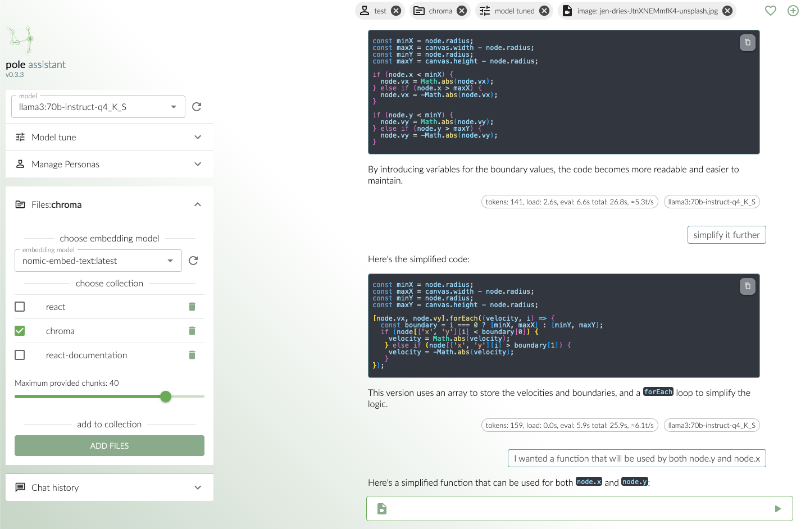
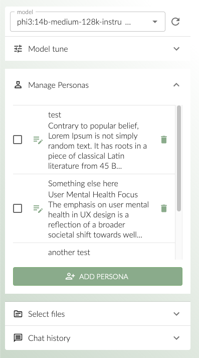
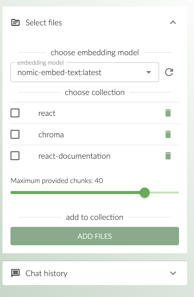
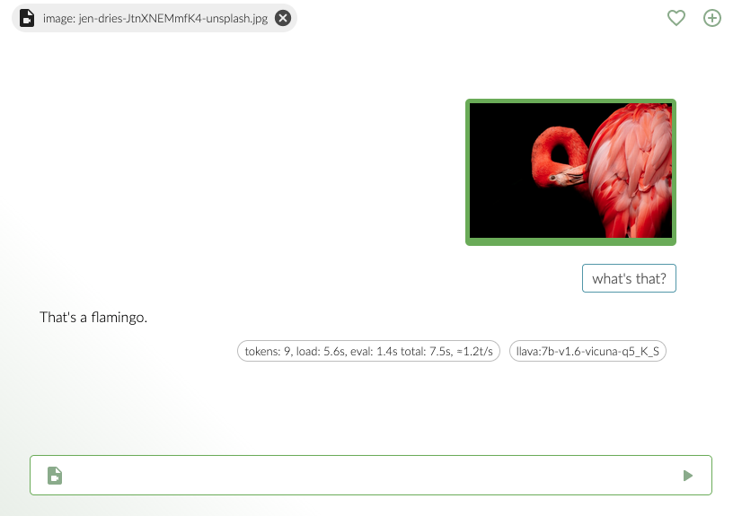

# Pole assistant

Is a tool meant for interactions with your offline LLM assitants.
The name stands for "field" in Polish but using the English meaning works for me as well!

<p align="center">
  
</p>
<p align="center">
  "pole" means field in Polish.  
</p>

# This is early beta, made with ExDD methodology.

This early stage beta version is built upon the ExDD methodology - short for Excitement Driven Development, a method that keeps the thrill alive while coding. It's exciting, but also means we need to be extra vigilant for any hiccups or missing bits.
While I did my best to make sure that all success paths work properly I cannot promise something won't break. Also some interactions are incomplite (there are no toast messages yet!). Every day I either add new feature or improve existing one

# Overview

<p align="center">
  
</p>
<p align="center">
  a view on the ui
</p>

<p align="center">
  
</p>
<p align="center">
  messages design, three icons on the right are (order top to bottom) - exclude message from context, diverege (start a new conversation from this point), regenerate (get a new answer to the previous question, using currently selected model)
</p>

<p align="center">
  
</p>
<p align="center">
  model options, hovering over the element shows a tooltip explaining the property. No value means it's using default ollama setup
</p>

<p align="center">
  
</p>
<p align="center">
  Personas, allows you to provide system propmt to the model. You can change the persona as you go, so a question would be answered by currently selected persona and previous answers (from different personas as well) will be included into the context.
</p>

<p align="center">
  
</p>
<p align="center">
  Chromadb integration allows vectorizing files and then "talking to them".
</p>

<p align="center">
  
</p>
<p align="center">
  There are 2 options to index files - you can specify directory path (it is host directory, so if you host the app on different machine you'll have to upload your files there) or manually upload files.
</p>

<p align="center">
  
</p>
<p align="center">
  You can ask questions about website contents. This feature is rather simple currently so watchout for context overflow.
</p>

<p align="center">
  
</p>
<p align="center">
  If you're using vision models you can ask questions about images too!
</p>

## Running

### Docker

For now the easiest way to try it out is to use docker compose. Images are on dockerhub.

```
services:
  pole-api:
    image: kweg/pole-api:0.1.3
    restart: unless-stopped
    volumes:
      - /path/to/db:/usr/src/app/db
    environment:
      CHROMA_SERVER: http://chroma_server
      OLLAMA_SERVER: http://olama_server
    ports:
      - 6550:3000
  pole-chat:
    restart: unless-stopped
    image: kweg/pole-chat:0.1.1
    environment:
      NODE_ENV: production
      REACT_APP_API: http://localhost:6550
    ports:
      - 6551:800
```

#### Variables

- `CHROMA_SERVER` - it's a path to your chroma instance. You can set it along as another service - for now Pole does not support credentials for chroma. This is security risk if you're exposing your server in any way. Have a look at chromadb documentation, there's also a dockerfile [chroma](https://github.com/chroma-core/chroma/tree/main)
- `OLLAMA_SERVER` - it's a path to your ollama instance. You can set it along as another service - for now this is only supported inference API. Choose your way to run it - [ollama](https://github.com/ollama/ollama)
- `REACT_APP_API` - it has to be address of the API service in most basic scenario it's exactly as on the sample

#### Volumes

- `usr/src/app/db` - is a file store, everything is stored as JSON files so you can have an easy access. If you choose not to persist this directory you'll loose all your data.

## Building

To be updated

### Prerequisites

- node.js v20
- Ollama for Inferencing
- Chroma.db for RAG

### Setup

Setup is rather strightforward, you should run `npm i` and once it's done `npm run build` this should create `build` directory which contains `.env` file.

```
services:
  chroma:
    image: ghcr.io/chroma-core/chroma:latest
    restart: unless-stopped
    environment:
      - IS_PERSISTENT=TRUE
    volumes:
      # Default configuration for persist_directory in chromadb/config.py
      # Currently it's located in "/chroma/chroma/"
      - /opt/chroma:/chroma/chroma/
    ports:
      - 8101:8000
    healthcheck:
      test: [ "CMD", "curl", "-f", "http://localhost:8101/api/v1/heartbeat" ]
      interval: 30s
      timeout: 10s
      retries: 3

  pole-api:
    image: kweg/pole-api:0.3.3
    restart: unless-stopped
    volumes:
      - /data/db:/usr/src/app/db
      - /data/uploads:/uploads
    environment:
      NODE_ENV: production
      CHROMA_SERVER: http://localhost:8101
      OLLAMA_SERVER: http://localhost:11434
    ports:
      - 6550:3000 # REST API
      - 6552:3001 # Sockets API

  pole-chat:
    restart: unless-stopped
    image: kweg/pole-chat:0.3.3
    environment:
      NODE_ENV: production
      REACT_APP_API: http://localhost:6550
      REACT_APP_SOCKET: http://localhost:6552
    ports:
      - 6551:80
```

### Running

The simplest way to run it is:
`cd build && node --env-file=.env bundle.js`

why enter the build dir? Because one directory above it it will create directories where data is stored. Changeability of paths is on roadmap.
